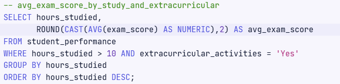
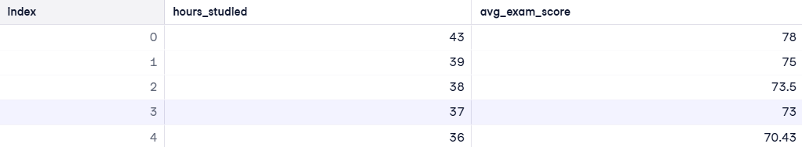
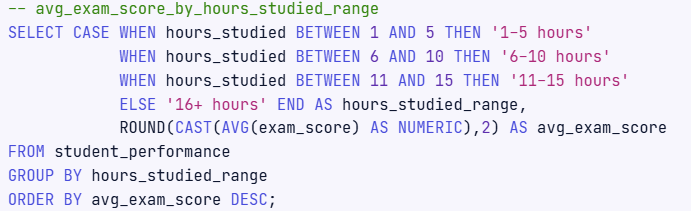
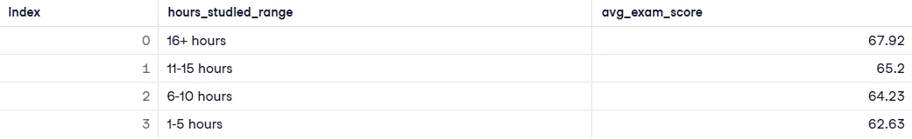
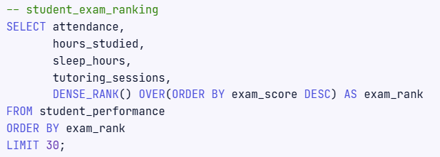
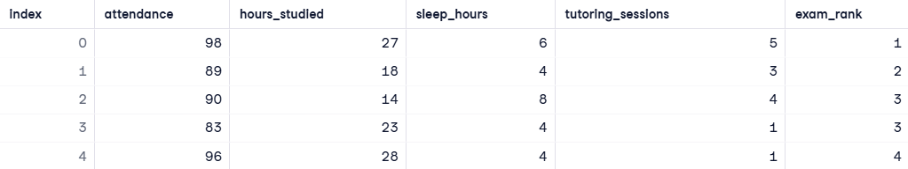

# Student Performance Analysis Project
In this project, we analyze various factors, such as study hours, extracurricular activities, attendance, and tutoring sessions, to uncover actionable insights. The results will help inform students and educators on how to optimize academic performance.

## Objectives
1. Analyze the impact of **study hours** combined with **extracurricular activities** on exam scores.
2. Identify the **optimal ranges of study hours** for better academic performance.
3. **Rank** students based on exam scores using window functions.

## Dataset Description
The project uses the **student_performance** table with the following columns:
- **attendance** - Percentage of classes attended (float)
- **extracurricular_activities** - Participation in extracurricular activities (Yes/No, varchar)
- **sleep_hours** - Average number of hours of sleep per night (float)
- **tutoring_sessions** - Number of tutoring sessions attended per month (integer)
- **teacher_quality** - Quality of the teachers (Low, Medium, High, varchar)
- **exam_score** - Final exam score (float)

## Installation
Clone this repository and install the necessary libraries:
```bash
git clone https://github.com/JReaves10/StudentPerformance
cd StudentPerformance
```
- Set up your SQL environment and ensure access to the student_performance table.
- Execute the SQL queries provided to generate the desired insights.

## Code Explanation
### 1. Analyze Study Hours and Extracurricular Activities
This query evaluates how studying more than 10 hours per week, combined with extracurricular involvement, impacts exam performance.



#### Output:


**. . .**

### 2. Identify Sweet Spots for Study Hours
This query groups students into ranges based on study hours and calculates the average exam score for each group.



#### Output:



### 3. Rank Students by Exam Performance
This query assigns ranks based on exam scores using a window function. Students with the same exam score share the same rank.



#### Output:


**. . .**
 
### Results
- **Impact of Study Hours and Extracurricular Activities**: Students who studied **over 10 hours per week and participated in extracurricular activities** tended to achieve higher exam scores.
- **Sweet Spot for Study Hours**: The best performance was observed among students studying **between 11 and 15 hours per week**.
- **Student Rankings**: The student_exam_ranking query provided an ordered view of top-performing students without revealing sensitive score details.

## Conclusion
This project highlights key factors influencing student success, including the importance of balanced study hours and extracurricular involvement. By leveraging SQL analytics, educational institutions can better guide students toward achieving their academic potential.

#### Technology Used
- Language: **SQL**
- Concepts: **Window Functions**, **Data Grouping**, **Statistical Analysis**
